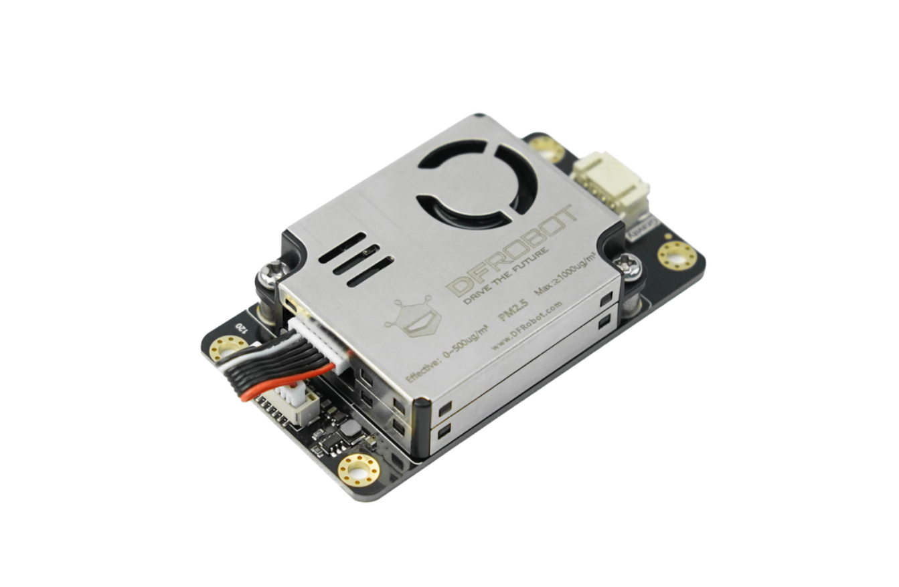
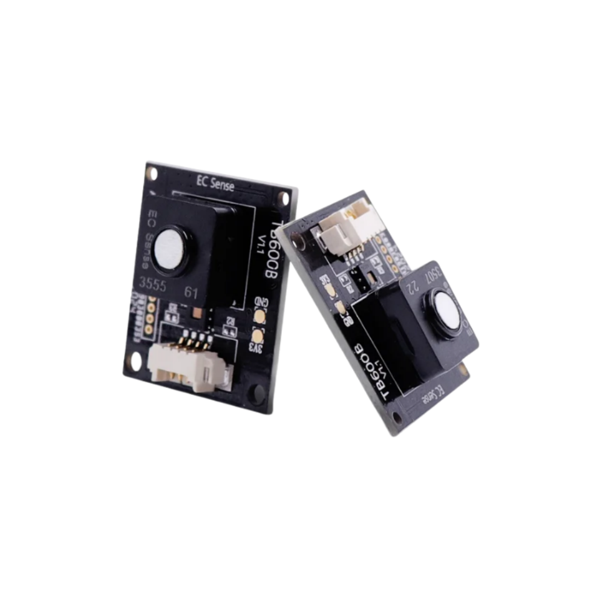
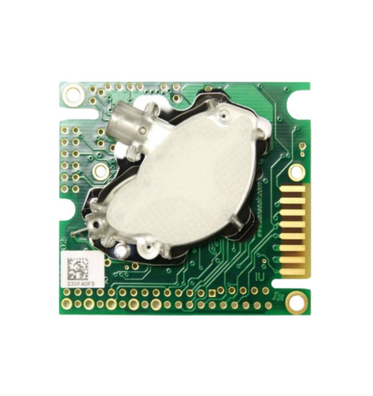
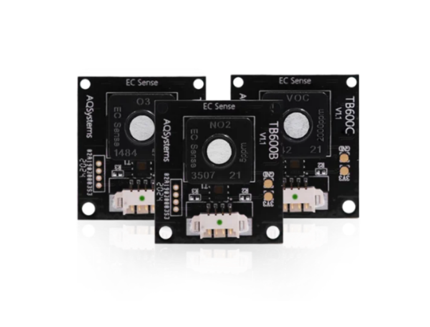
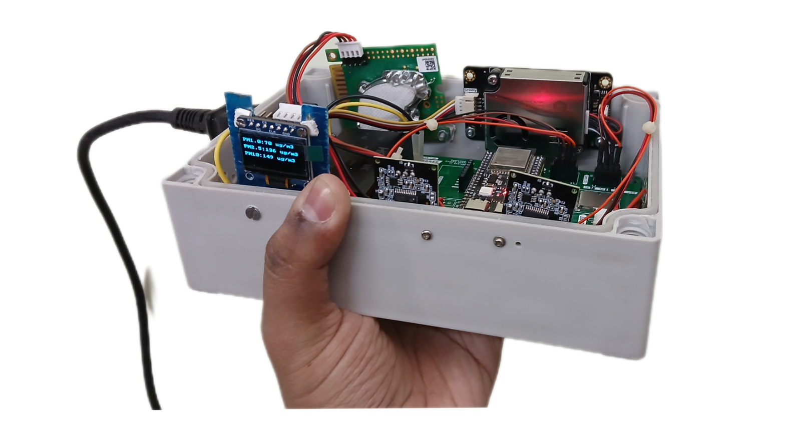
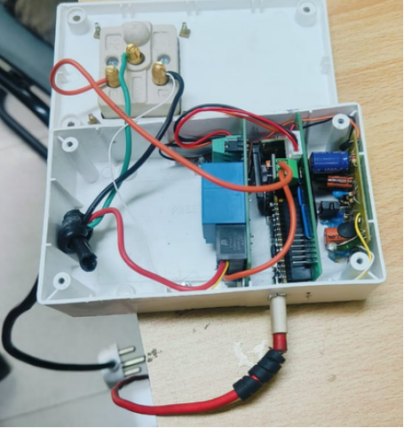

# Sensors Used in AirWise Deployment

This document lists the exact hardware components used in the AirWise: LLM-Powered Smart Air Quality
Monitoring and Automated Appliance Control.

---

## 1. Dust Sensor – DF Robot SEN0460

- Manufacturer: DF Robot
- Model: SEN0460
- Measures: PM1.0, PM2.5, PM10
- Particle Detection Range: 0.3 μm – 10 μm
- Response Time: < 10 seconds
- Application: Indoor particulate monitoring and pollution spike detection

---

## 2. Carbon Monoxide (CO) Sensor – EC Sense TB600B-CO

- Manufacturer: EC Sense
- Model: TB600B-CO
- Measurement Range: 0–100 ppm
- Resolution: 0.1 ppm
- Update Time: < 3 seconds
- Application: Detection of harmful CO levels and combustion-related air risks

---

## 3. Carbon Dioxide (CO₂) Sensor – Senseair K30

- Manufacturer: Senseair
- Model: K30
- Measurement Range: 0–5000 ppm
- Accuracy: ±3%
- Response Time: < 20 seconds
- Application: Ventilation control and occupancy-related air quality assessment

---

## 4. VOC + Temperature + Humidity Sensor – EC Sense TB600B-VOC

- Manufacturer: EC Sense
- Model: TB600B-VOC
- VOC Measurement Range: 0–10 ppm
- VOC Resolution: 0.01 ppm
- Update Time: < 3 seconds
- Also Measures:
  - Ambient Temperature
  - Relative Humidity
- Application: Multi-parameter environmental monitoring

---

## 5. Embedded Monitoring Device (EMD)

- Microcontroller-based embedded device
- Integrates all sensor inputs
- Performs:
  - Edge preprocessing
  - TinyML-based denoising
  - Local data logging
- Connectivity:
  - Wi-Fi (Cloud Sync)
  - BLE (Local Sync)
- Features:
  - OLED display
  - SD card storage
  - Real-Time Clock (RTC)

---

## 6. Digital Smart Socket (Actuation Layer)

- Used for appliance-level control
- Enables:
  - AC Switching Power ON/OFF.
  - AC Modes (COOL,FAN)
- Controlled via secure MQTT communication
